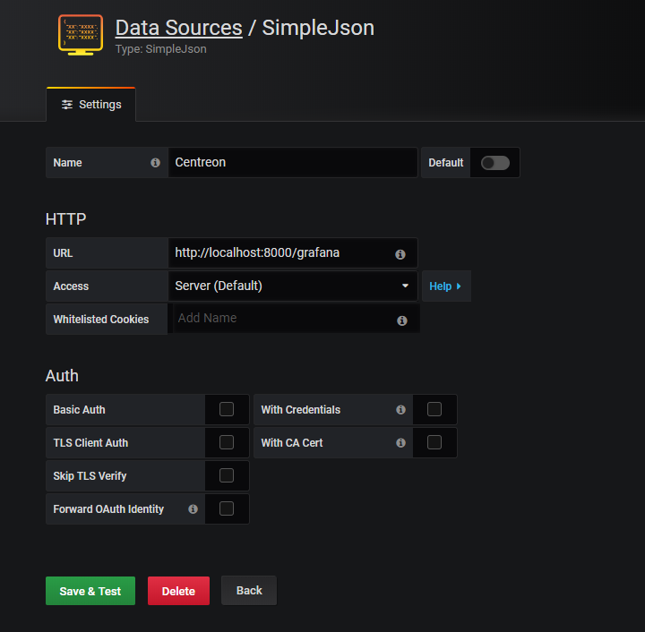

# grafana-simple-json-datasource-centreon

An API binder to use Centreon metrics as a [SimpleJson Grafana datasource](https://github.com/grafana/simple-json-datasource).

Requires the installation of the [SimpleJson](https://grafana.com/plugins/grafana-simple-json-datasource/installation) Grafana plugin.

## Implementation details

It relies on [Transatel/lib-eloquent-centreon](https://github.com/Transatel/lib-eloquent-centreon) for accessing Centreon's dataabses and calling its [internal](https://github.com/centreon/centreon/tree/master/www/include/common/webServices/rest) REST API.

### Caching

There is caching of the list of available metrics (i.e. services providing perf data).

To force the reconstruction of the cache, just send:

```
DELETE localhost:8000/grafana
```

### Regex support

Regex are supported when searching available series with the (`POST /grafana/search`).

## Configuration

Copy the [.env.example](.env.example) file into a new `.env` file.

There are are the keys you might want to edit (if you changed default values).

After modifying them, one might want to do a `php artisan config:clear` to ensure older cached values are purged.

### Centreon Internal REST API

| Key                                | Description                        |
| --                                 | --                                 |
| CENTREON\_INTERNAL\_REST\_API\_URL | URL of Centreon internal REST API  |
| CENTREON\_REST\_API\_USERNAME      | Username for the internal REST API |
| CENTREON\_REST\_API\_PASSWORD      | Password for the internal REST API |

### Centreon Storage DB schema (volatile data)

| Key                             | Description                                          |
| --                              | --                                                   |
| DB\_HOST\_CENTREON\_STORAGE     | Domain Name or IP address to connect to the database |
| DB\_PORT\_CENTREON\_STORAGE     | Port to connect to the database                      |
| DB\_DATABASE\_CENTREON\_STORAGE | Name of the schema                                   |
| DB\_USERNAME\_CENTREON\_STORAGE | Username to connect to the database                  |
| DB\_PASSWORD\_CENTREON\_STORAGE | Password to connect to the database                  |

## Usage

### Retrieve dependencies

	$ composer update

### Launch

#### Development mode

You can quick start.

	$ php -S 0.0.0.0:8000 -t public

#### Example Apache configuration

```
<VirtualHost *:8000>
  ServerName grafana-simple-json-datasource-centreon
  DocumentRoot "/opt/grafana-simple-json-datasource-centreon/public"
  <Directory "/opt/grafana-simple-json-datasource-centreon/public/">
    Options Indexes FollowSymLinks
    AllowOverride all
    Require all granted
  </Directory>
</VirtualHost>
```

### Test

#### Basic connection

```
GET localhost:8000/grafana
```

#### Retrieval of all series

```
POST localhost:8000/grafana/search
Content-Type: application/json

{
	"target": ""
}
```

#### Declaration in Grafana


